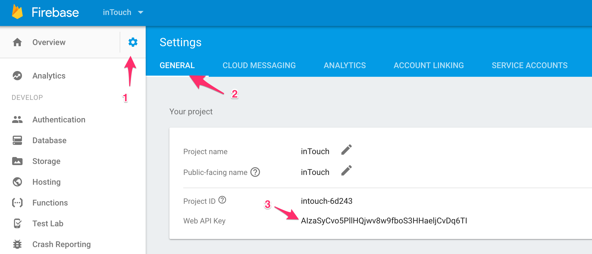
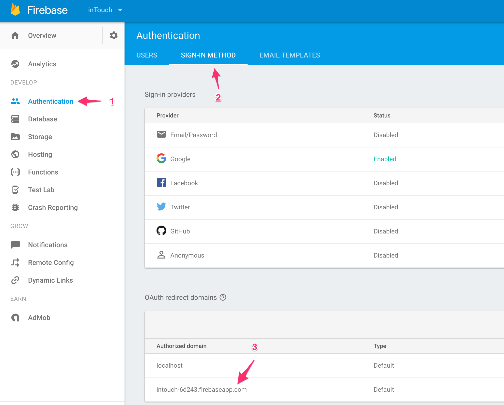
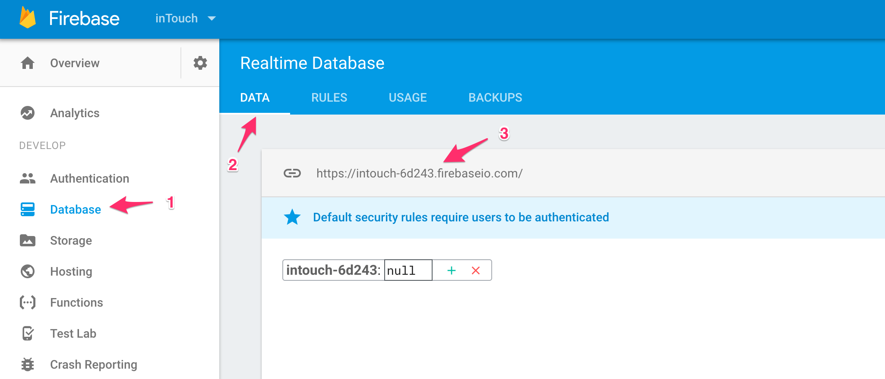
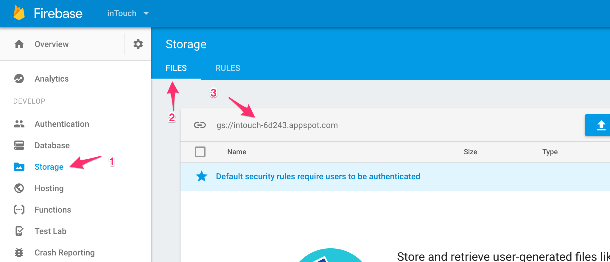
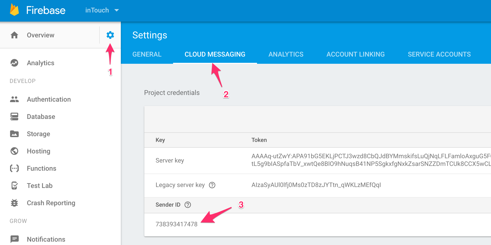

# AngularFire  2 - Setup

AngularFire 2 has an official [Installation & Setup](https://github.com/angular/angularfire2/blob/master/docs/1-install-and-setup.md) guide. Hence this guide focuses on integrating AngularFire 2 in the app architecture generated by Angular CLI.

## Pre-requisite

+ A [Firebase](https://firebase.google.com/) account
+ A Firebase project inside the [Console](https://console.firebase.google.com/)
+ The [Firebase CLI](https://github.com/firebase/firebase-tools)

## Install Dependencies

`yarn add angularfire2`

`yarn add firebase`

## Initialize Firebase

Run `firebase init` from the command line to initialize Firebase in your repo. Choose `Hosting` if you want Firebase to also serve your website on the web.

It will also ask you to link to the Firebase project you should have created already as Pre-requisite.

If you chose `Hosting` option, it will ask you for the `public directory` which you should set as `dist` which is the default build directory for Angular CLI generated project.

## Setup AngularFire

Reference [Setup @NgModule](https://github.com/angular/angularfire2/blob/master/docs/1-install-and-setup.md#4-setup-ngmodule)

## Get Your Keys

### apiKey

### authDomain

### databaseURL

### storageBucket

### messagingSenderId

## Test Drive AngularFire

Reference [Inject AngularFire](https://github.com/angular/angularfire2/blob/master/docs/1-install-and-setup.md#5-inject-angularfire)
