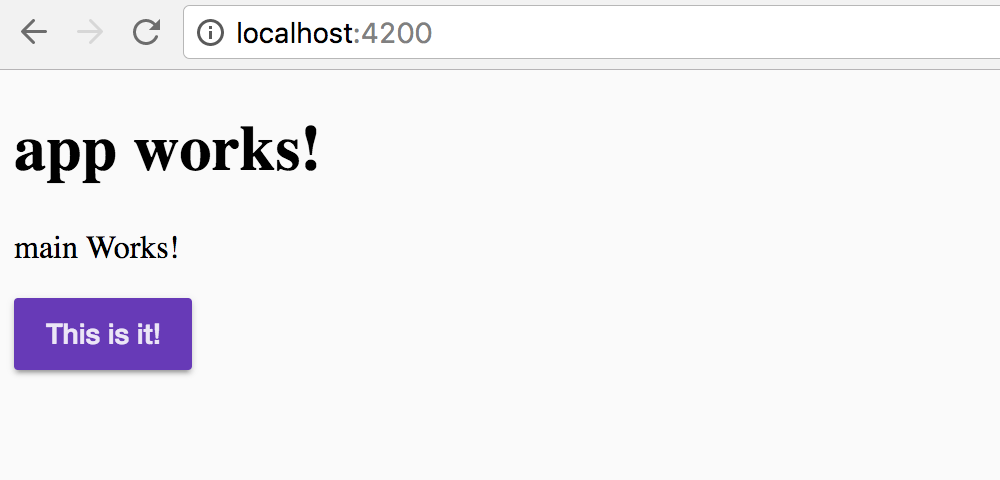

# Angular Material 2

Angular Material 2 has an official [Getting Started](https://github.com/angular/material2/blob/master/guides/getting-started.md) guide. Hence this guide focuses on integrating Angular Material 2 in the environment scaffoled by Angular CLI.

## Install Dependencies

`yarn add @angular/material`

`yarn add @angular/animation`

`yarn add hammerjs`

## Include Modules

Open `src/app/app.module.ts` and add the following modules.

```
import { MaterialModule } from '@angular/material';

@NgModule({
  ...
  imports: [
    MaterialModule,
    BrowserAnimationsModule
  ],
  ...
})

```

## Include Pre-Built Theming

Open `src/style.[scss/less/css]` and add the following import statement at the top.

`@import '~@angular/material/core/theming/prebuilt/deeppurple-amber.css';`

Open `src/index.html` and add `mat-app-background` class to the body tag.

`<body class="mat-app-background">`

## Create Custom Theming

If you are ready to get started with your custom theme, follow the official [Theming your Angular Material app](https://github.com/angular/material2/blob/master/guides/theming.md)

## (Optional) Add Material Icons

Include the following link tag in `src/index.html`

`<link href="https://fonts.googleapis.com/icon?family=Material+Icons" rel="stylesheet">`

## Start using Angular Material components

Head over to [Angular Material](https://material.angular.io/components) to see all the supported components.

For example, try adding the following button element inside one of your components.

`<button md-raised-button color="primary">This is it!</button>`

It should render like the following!


