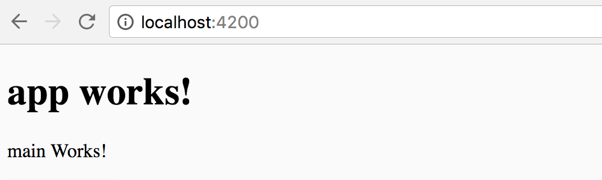

# Angular Cheatsheet

This is an Angular cheatsheet for projects using latest Angular CLI. Our aim is to minimize Googling or hooping through countless docs for setting up popular features.

## Additional Documents

+ Install CSS Frameworks: [Angular Material 2](AngularMaterial-2.md)
+ Install serverless databases: [AngulareFire 2](AngularFire-2.md)
+ Install third-party libraries: [Third Party Libraries](ThirdPartyLibraries.md)

## Pre-requisite

+ Latest stable Node.js, [n](https://github.com/tj/n) is the recommended Node.js version manager
+ Install [Angular CLI](https://cli.angular.io/)

## Set Yarn as the default package manager

Do you use [Yarn](https://github.com/yarnpkg/yarn)? You can [set Yarn as the default package manager](https://medium.com/@beeman/using-yarn-with-angular-cli-db2e318e43c5) when you scaffold Angular using Angular CLI.

`ng set --global packageManager=yarn`

## Initialize an app with Angular CLI

First of all, install [Angular CLI](https://cli.angular.io/).

Then, run following command to let CLI do all the base scaffolding work for you. Angular CLI will generate build script, root app module, unit/e2e testing integration, environments, etc.

`ng new PROJECT_NAME`

Optional arguments, [see more](https://www.sitepoint.com/understanding-component-architecture-angular/):

- `--style=scss` — Use SCSS instead of CSS 
- `--routing=true` — Include Router
- `--inline-style=true` — Do not generate stylesheet files
- `--inline-template=true` — Do not auto-generate template files

## Create the main component

Your app could consist public facing pages, admin-only pages, and/or secure logged-in user only pages.

If you are unsure about how to structure the app as you are scaffolding, start with a generic `main` component to serve what most visitors will see first. 

`ng g component main`

Here you can use optinal arguments as well:

- `--inline-style=true` — Do not generate stylesheet file
- `--inline-template=true` — Do not auto-generate template file

### Component vs ngModule

Are you curious why we are not using [ngModule](http://blog.angular-university.io/angular2-ngmodule/) here? Unless you have an established architecture for the app, stick with what's simple for now, and you can worry about more sophisticated organization and loading optimization later.

### Import MainComponent

Now let's open your routing module which is created at `src/app/app-routing.module.ts` if you've used `--routing=true` argument as you generated the app with Angular CLI.

```typescript
import { MainComponent } from './main/main.component';
```

### Add MainComponent to routes

In the same file, let's include MainComponent to routes, assuming we want to load it as the root path in the URL. See other [Router options ](https://angular.io/docs/ts/latest/guide/router.html) if you are curious.

```typescript
const routes: Routes = [
  ...
  {
    path: '',
    component: MainComponent
  }
  ...
];
```

### Check in the browser!


