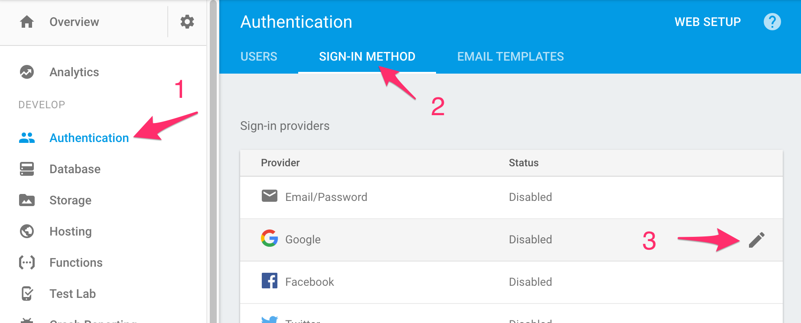

# AuthGuard with Firebase

## Activate Sign-In Method

Navigate to your profoject within [Firebase Console](https://console.firebase.google.com/) and activate Google sign-in method which comes with zero configuration as part of being Google product.



## Generate Auth service

Run the following command in the terminal.

`ng g service services/auth`

Copy [auth.service.ts](auth.service.ts) content into the file.

Be sure to change redirect path references to match your routing configs.

## Generate AuthGuard service

Run the following command in the terminal.

`ng g service services/auth-guard`

Copy [auth.service.ts](auth-guard.service.ts) content into the file.

## Import Auth and AuthGuard services

Open `src/app/app.module.ts` and import auth services you just generated.

```typescript
import { AuthService } from './services/auth.service';
import { AuthGuardService } from './services/auth-guard.service';
...
@NgModule({
  ...
  providers: [AuthGuardService, AuthService],
  ...
})
```

## Initialize Firebase auth

Open `src/app/app.module.ts` and initialize Firebase Auth.

Reference: [Configure application in bootstrap](https://github.com/angular/angularfire2/blob/master/docs/5-user-authentication.md)

## Activate AuthGuard

Open `src/app/app-routing.module.ts` and activate AuthGuard for the component you want to guard behind Firebase auth. Here we are using `DashboardComponent` as an example.

```typescript
import { DashboardComponent } from './dashboard/dashboard.component';
import { AuthGuardService } from './services/auth-guard.service';
...
const routes: Routes = [
  ...
  {
    path: 'dashboard',
    component: DashboardComponent,
    canActivate: [AuthGuardService]
  }
  ...
];
```

At this point, try visiting `/dashbaord` or your custom AuthGuard page and you should get redirect back to fallback path you set.

## Add login button

Open a component where you want to add a login button, and add following code.

```typescript
import { AuthService } from '../services/auth.service';
...
export class... {
  ...
  constructor(
    private authService: AuthService
  ) { }
  ...
  login() {
    this.authService.login();
  }
  ...
}
```

And in the template, simply add a button that binds to the click handler.

```html
<button (click)="login()">Login</button>
```

## Optional: Set dashbaord as home instead

Does your app require user login before they can see anything? If so you can set guarded module as the default empty path, and redirect users to '/login' path.

Once you create `LoginComponent`, open `src/app/app-routing.module.ts` and follow the code below.

```typescript
import { LoginComponent } from './login/login.component';
import { DashboardComponent } from './dashboard/dashboard.component';
import { AuthGuardService } from './services/auth-guard.service';
...
const routes: Routes = [
  ...
  {
    path: '',
    component: DashboardComponent,
    canActivate: [AuthGuardService]
  },
  {
    path: 'login',
    component: LoginComponent,
  }
  ...
];
```

Then, be sure to update redirect paths in `src/app/services/auth.service.ts` so users are redirected to `login` if they are not logged in, and to `dashbaord` if the arey.
